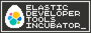

# Contributing to the Developer Tools Incubator

Elastic engineers are encouraged to share their Spacetime efforts and side projects with the world.
Dozens of useful tools are in daily use by developers using Elastic, but many can be hard to find and the terms of use are not always clear.
If you have a project that can make someone else's life easier, get in touch with the Developer Tools Team and get it listed!

## What to Include

Before publishing a project, make sure you have the following items in place:
- A top level `README` or `README.md` file that explains what the project is, who it is for, and how to install and use it.
- A license file (usually called `LICENSE`). If you need help on which license to select, then speak to the [Open Source Software Working Group (OSSWG)](https://github.com/elastic/open-source) or the Developer Tools Team.

Optionally, we also recommend that you include the badge and wording below, which denotes the project's status as part of the incubator program, and specifically as experimental and unsupported:

> 
>
> This project is part of the [Elastic Developer Tools Incubator](https://github.com/technige/devtools-incubator) program. It should be considered experimental and, as such, should not be used in a production context. Updates, bug fixes, and support are not routinely provided for this project at this time.